<div align="center">


<a href="https://github.com/sachincoder11">
  
</a>

<br />

<a href="mailto:sdineshdumbre@gmail.com"></a>
<a href="https://github.com/sachincoder11"></a>
<a href="https://dev.to/sachincoder"></a>

</div>

---

<div align="center">

### 🧭 Navigate

[About](#-about-me) · [Focus](#-current-focus) · [Skills](#-capability-map) · [Flagship Build](#-flagship-build--automated-financial-intelligence-pipeline) · [Projects](#-selected-projects) · [RAG Deep-Dive](#-deep-dive--codebase-rag-platform) · [Journey](#-data-science-journey) · [Building Now](#-currently-building) · [GitHub Stats](#-github-activity) · [Contact](#-lets-build-something-useful)

</div>

---

<!-- ═══════════════════════════════════════════════════════════════
     QUICK FACTS
     ═══════════════════════════════════════════════════════════════ -->

<div align="center">
  
</div>

<table>
  <tr>
    <td>📍 Based in India</td>
    <td>🎯 Direction: Data Science + AI + Software Engineering</td>
  </tr>
  <tr>
    <td>📊 Focus: Analytics · EDA · SQL · Statistical Analysis</td>
    <td>🤖 Exploring: Generative AI · RAG · LLM Applications</td>
  </tr>
  <tr>
    <td>💻 Background: Full-Stack Web Development</td>
    <td>🚀 Building: Data-driven analytical systems</td>
  </tr>
</table>

---

<!-- ═══════════════════════════════════════════════════════════════
     ABOUT ME
     ═══════════════════════════════════════════════════════════════ -->

<div align="center">
  
</div>

## 👋 About me

I started in **frontend and full-stack web development** — building interfaces, APIs, and database-backed applications with React, Node.js, and MySQL. That work taught me how to structure products and ship working software.

Over time, I became more interested in what happens *behind* the interface: **how data moves through a system, what patterns it contains, and how those patterns can inform decisions**. That interest pulled me toward Python, SQL, Pandas, and statistical analysis — and eventually toward machine learning and generative AI.

Today I'm building at the intersection of those areas:

> **Data pipelines** that clean and validate real-world financial data
> **Exploratory analysis** that surfaces trends, anomalies, and statistical patterns
> **RAG systems** that ground LLM responses in actual source material
> **Analytical interfaces** that make complex data understandable

I don't claim mastery across all of these. I'm building depth progressively — each project adds a layer to what I can actually do and demonstrate.

```
Web Development → Full-Stack Engineering → Python + SQL → Data Analytics
→ EDA + Statistics → Machine Learning → Generative AI → Data-Driven AI Products
```

---

<!-- ═══════════════════════════════════════════════════════════════
     CURRENT FOCUS
     ═══════════════════════════════════════════════════════════════ -->

<div align="center">
  
</div>

## 🧠 Current focus

<table>
  <tr>
    <td width="25%" valign="top">
      <h3>📊 Data &amp; Analytics</h3>
      <strong>Core:</strong><br />
      Python · Pandas · NumPy<br />
      SQL · EDA · Matplotlib · Seaborn<br /><br />
      <strong>Learning:</strong><br />
      Statistics · Scikit-learn<br />
      Data visualization best practices
    </td>
    <td width="25%" valign="top">
      <h3>🤖 Generative AI</h3>
      <strong>Building with:</strong><br />
      RAG · ChromaDB<br />
      Sentence Transformers<br />
      Ollama · Hugging Face<br /><br />
      <strong>Exploring:</strong><br />
      LLM application patterns<br />
      Embedding strategies
    </td>
    <td width="25%" valign="top">
      <h3>💰 Applied Direction</h3>
      <strong>Current project:</strong><br />
      Financial data analytics<br />
      Company P&amp;L analysis<br /><br />
      <strong>Investigating:</strong><br />
      Business intelligence<br />
      Decision-support systems<br />
      FinTech data pipelines
    </td>
    <td width="25%" valign="top">
      <h3>💻 Engineering</h3>
      <strong>Core:</strong><br />
      JavaScript · TypeScript<br />
      React · Node.js · Express<br /><br />
      <strong>Tools:</strong><br />
      Git · Docker · FastAPI<br />
      MySQL · REST APIs
    </td>
  </tr>
</table>

---

<!-- ═══════════════════════════════════════════════════════════════
     CAPABILITY MAP
     ═══════════════════════════════════════════════════════════════ -->

<div align="center">
  
</div>

## 🗺️ Capability map

> Skills are labeled by evidence level. **Core** = demonstrated in repositories. **Learning** = actively studying, limited repo evidence. **Exploring** = early investigation.

```
Data Science & Analytics               Generative AI & LLMs
├── Python ················· Core      ├── RAG Pipelines ········· Core
├── Pandas ················· Core      ├── ChromaDB ·············· Core
├── NumPy ·················· Core      ├── Sentence Transformers · Core
├── SQL / MySQL ············ Core      ├── Ollama ················ Core
├── EDA ···················· Core      ├── Hugging Face ·········· Core
├── Matplotlib ············· Core      ├── LLM Applications ····· Building
├── Seaborn ················ Core      ├── Embeddings ··········· Building
├── Scikit-learn ··········· Learning  └── Vector Search ········ Building
├── Statistics ············· Learning
└── Machine Learning ······· Learning  Visualization & BI
                                       ├── Matplotlib ··········· Core
Software Engineering                   ├── Seaborn ·············· Core
├── JavaScript ············· Core      ├── Excel ················ Learning
├── TypeScript ············· Core      └── Power BI ············· Exploring
├── React ·················· Core
├── Node.js / Express ······ Core
├── FastAPI ················ Core
├── REST APIs ·············· Core
├── Git ···················· Core
├── Docker ················· Core
└── HTML / CSS ············· Core
```

<div align="center">
  <a href="https://skillicons.dev">
    
  </a>
</div>

---

<!-- ═══════════════════════════════════════════════════════════════
     FLAGSHIP BUILD
     ═══════════════════════════════════════════════════════════════ -->

<div align="center">
  
</div>

## 🚀 Flagship build — Automated Financial Intelligence Pipeline

 

> A data-analysis pipeline that processes real corporate financial data (P&amp;L statements from XBRL filings), performs deterministic financial and statistical analysis, and presents verified findings. The AI layer is deliberately downstream — it explains structured findings, not raw data.

### Pipeline architecture

```
Raw XBRL financial data (96,632 rows × 130 columns)
        ↓
Data validation · quality checks · missing-data assessment
        ↓
Period filtering · schema normalization · revenue validation
        ↓
Metric derivation (profit margins, cost ratios, R&amp;D intensity)
        ↓
Statistical analysis · distribution checks · outlier detection
        ↓
Correlation analysis · finance-cost burden quartiles
        ↓
Structured verified findings
        ↓
AI-assisted interpretation (planned)
        ↓
Context-aware dashboard (planned)
```

### What the analysis investigates

| Domain | Scope |
| :--- | :--- |
| **Financial metrics** | Revenue, expenses, profit/loss, savings rate, profit margins, expense ratios |
| **Cost analysis** | Finance-cost burden, employee-cost ratios, R&amp;D intensity |
| **Statistical patterns** | Distribution analysis, skewness checks, IQR outlier detection |
| **Correlations** | Revenue–expense relationship, finance-cost vs. margin, cross-variable matrix |
| **Data quality** | Missingness audit (7M+ missing cells in raw data), empty-column removal, duplicate detection |

### Data provenance

| Field | Detail |
| :--- | :--- |
| **Primary dataset** | XBRL P&amp;L reporting data (company-level financial statements) |
| **Rows × Columns** | 96,632 × 130 (raw); 45,414 × 19 (cleaned analytical output) |
| **Reporting period** | FY 2024–25 (current period filter: 2024-04-01 to 2025-03-31) |
| **Key fields** | Revenue, expenses, profit/loss, tax, finance costs, employee costs, depreciation, R&amp;D |
| **Missing data** | 7,001,669 total missing cells in raw file — handled per-metric, documented |
| **Derived dataset** | `MCA_PL_FY2024_25_Clean_Analysis.csv` — revenue-positive records with calculated ratios |
| **External source URL** | To be documented |
| **Supporting data** | Company master data (1M+ rows) for entity metadata enrichment (future validated join) |

### Project status

| Component | Status |
| :--- | :--- |
| Data ingestion (CSV/XLSX) | 🔵 Completed |
| Quality checks and cleaning pipeline | 🔵 Completed |
| Period filtering and schema normalization | 🔵 Completed |
| Core financial metrics and ratio derivation | 🔵 Completed |
| Statistical analysis (distributions, outliers, correlations) | 🔵 Completed |
| Visualization (profit margin dist., burden analysis, correlation matrix) | 🔵 Completed |
| SQL database setup and identity queries | 🔵 Completed |
| Research document and scope definition | 🔵 Completed |
| AI explanation service | ⚪ Planned |
| Context-aware dashboard | ⚪ Planned |
| DOCX/PDF extraction | ⚪ Planned (future phase) |

<div align="center">


<br /><br />

<a href="https://github.com/sachincoder11/Automated_Financial_Intelligence_Pipeline"></a>

</div>

---

<!-- ═══════════════════════════════════════════════════════════════
     SELECTED PROJECTS
     ═══════════════════════════════════════════════════════════════ -->

<div align="center">
  
</div>

## 📂 Selected projects

**Status indicators:** 🟢 Active · 🟡 In Progress · 🔵 Completed · ⚪ Archived · 🧪 Experimental

### 📊 Data &amp; Analytics

| Project | Description | Tech | Status |
| :--- | :--- | :--- | :---: |
| **[Financial Intelligence Pipeline](https://github.com/sachincoder11/Automated_Financial_Intelligence_Pipeline)** | Deterministic financial analysis of 96K+ corporate P&amp;L records — metric derivation, statistical patterns, outlier detection, and correlation analysis with documented data provenance | Python · Pandas · NumPy · SQL · Matplotlib · Seaborn | 🟢 |
| **[Space Mission EDA](https://github.com/sachincoder11/Space_Mission_EDA_Project)** | Exploratory analysis of 4,324 historical orbital launches (1957–2020) investigating mission reliability, organizational patterns, launch-vehicle frequency, seasonal trends, and price-imputation methodology | Python · Pandas · Matplotlib · Seaborn · Jupyter | 🟡 |
| **[Aqua-Nova](https://github.com/sachincoder11/Aqua-Nova)** | Data analysis project | Jupyter Notebook | 🟡 |

### 🤖 AI / Generative AI

| Project | Description | Tech | Status |
| :--- | :--- | :--- | :---: |
| **[Codebase RAG Platform](https://github.com/sachincoder11/Codebase_RAG_Platform)** | Full RAG application for understanding software repositories — upload a ZIP or clone a Git repo, then ask grounded questions with file-level citations and source references | Python · FastAPI · ChromaDB · Ollama · Sentence Transformers · Docker | 🟢 |

### 💻 Web &amp; Full-Stack

| Project | Description | Tech | Status |
| :--- | :--- | :--- | :---: |
| **[bloodbanks](https://github.com/sachincoder11/bloodbanks)** | Blood bank management system — web interface for blood-bank workflows | Web technologies | 🔵 |
| **[np-clinic](https://github.com/sachincoder11/np-clinic)** | Clinic management application | TypeScript | 🟡 |
| **[TravelNexus](https://github.com/sachincoder11/Travle-nexus)** | Travel-focused web application | JavaScript · HTML · CSS | 🔵 |

---

<!-- ═══════════════════════════════════════════════════════════════
     DEEP-DIVE: RAG PLATFORM
     ═══════════════════════════════════════════════════════════════ -->

<div align="center">
  
</div>

## 🔬 Deep-dive — Codebase RAG Platform

 

> A local-first Retrieval-Augmented Generation application for understanding software repositories. Upload a codebase, ask questions, and receive grounded answers with file-level citations.

### How it works

```
Repository (ZIP or Git URL)
     ↓
Repository Scanner → Language Parsers (Python, JS/TS, Java, .NET)
     ↓
Semantic Chunker → Code-aware chunks with metadata
     ↓
Embedding Provider (BAAI/bge-small-en-v1.5)
     ↓
ChromaDB Vector Store (persistent, per-repository isolation)
     ↓
Question → Embed → Similarity Search → Retrieval + Ranking
     ↓
Context Builder → LLM Provider (Ollama / OpenRouter / HuggingFace)
     ↓
Grounded Answer + File Paths + Line Ranges + Confidence Score
```

### Architecture highlights

| Component | What it does |
| :--- | :--- |
| **26+ backend services** | Architecture analyzer, security analyzer, dependency analyzer, engineering-quality evaluator, license analyzer, codebase evaluator |
| **Multi-provider design** | Swap LLM, embedding, and vector-store providers via environment variables — no code changes |
| **Code-aware chunking** | Chunks carry file path, language, entity type, and line ranges — not naive text splitting |
| **Report generation** | Architecture, security, dependency, licensing, and engineering-quality analysis |
| **Docker orchestration** | Full `docker-compose.yml` with FastAPI, ChromaDB, Ollama, Redis, and Celery worker services |
| **Browser UI + API** | Vanilla HTML/CSS/JS frontend, plus full OpenAPI documentation at `/docs` |

### Technology

<div align="center">


<br /><br />

<a href="https://github.com/sachincoder11/Codebase_RAG_Platform"></a>

</div>

---

<!-- ═══════════════════════════════════════════════════════════════
     DATA SCIENCE JOURNEY
     ═══════════════════════════════════════════════════════════════ -->

<div align="center">
  
</div>

## 🗺️ Data science journey

```mermaid
flowchart LR
    A["Frontend Development\n HTML · CSS · JS"] --> B["Full-Stack Engineering\n React · Node · MySQL"]
    B --> C["Python &amp; SQL\n scripting · queries · automation"]
    C --> D["Data Analytics\n Pandas · EDA · visualization"]
    D --> E["Statistics &amp; ML\n distributions · correlations · scikit-learn"]
    E --> F["Generative AI\n RAG · LLMs · embeddings"]
    F --> G["Data-Driven AI Products\n analytical pipelines"]
    style A fill:#0B0B0B,stroke:#FFCA28,color:#fff
    style B fill:#1a0a0f,stroke:#FF1744,color:#fff
    style C fill:#FF1744,stroke:#FFCA28,color:#fff
    style D fill:#0B0B0B,stroke:#FF1744,color:#fff
    style E fill:#1a0a0f,stroke:#FFCA28,color:#fff
    style F fill:#FF1744,stroke:#0B0B0B,color:#fff
    style G fill:#FFCA28,stroke:#0B0B0B,color:#0B0B0B
```



Each stage builds on the last. Web development gave me product-building fundamentals. Full-stack work taught me APIs, databases, and system design. Python and SQL opened the door to working with data directly. Now I'm applying all of that to build analytical systems that can process real-world data, identify patterns, and — with AI assistance — communicate findings clearly.

I'm building depth progressively, not claiming mastery of every layer.

---

<!-- ═══════════════════════════════════════════════════════════════
     CURRENTLY BUILDING
     ═══════════════════════════════════════════════════════════════ -->

<div align="center">
  
</div>

## 🔨 Currently building

| Project | Status | Current work | Next milestone | Repository |
| :--- | :---: | :--- | :--- | :--- |
| **Financial Intelligence Pipeline** | 🟢 Active | Statistical analysis complete; research scope finalized; EDA notebooks with derived metrics and visualizations | AI explanation service; context-aware dashboard | [Repository](https://github.com/sachincoder11/Automated_Financial_Intelligence_Pipeline) |
| **Codebase RAG Platform** | 🟢 Active | Full RAG lifecycle operational; multi-provider architecture; Docker deployment | Consolidated test suite; production hardening | [Repository](https://github.com/sachincoder11/Codebase_RAG_Platform) |
| **Space Mission EDA** | 🟡 In Progress | 4,324-mission analysis complete; price-imputation methodology documented | Resolve price provenance; add reproducible pipeline | [Repository](https://github.com/sachincoder11/Space_Mission_EDA_Project) |

---

<!-- ═══════════════════════════════════════════════════════════════
     GITHUB ACTIVITY
     ═══════════════════════════════════════════════════════════════ -->

<div align="center">
  
</div>

## 📊 GitHub activity

<div align="center">
  <a href="https://git.io/streak-stats"></a>
  <br /><br />
  
</div>

---

<!-- ═══════════════════════════════════════════════════════════════
     REPOSITORY SHOWCASE
     ═══════════════════════════════════════════════════════════════ -->

<div align="center">
  
</div>

## 📌 Repository showcase

> These repositories represent my strongest work across Data Science, AI, and Software Engineering. Each links to a detailed README with methodology, architecture, and technical documentation.

<div align="center">

<a href="https://github.com/sachincoder11/Automated_Financial_Intelligence_Pipeline">
  
</a>
<a href="https://github.com/sachincoder11/Codebase_RAG_Platform">
  
</a>
<a href="https://github.com/sachincoder11/Space_Mission_EDA_Project">
  
</a>
<a href="https://github.com/sachincoder11/Codebase_RAG_Platform">
  
</a>

</div>

---

<!-- ═══════════════════════════════════════════════════════════════
     COLLABORATION / CONTACT
     ═══════════════════════════════════════════════════════════════ -->

<div align="center">

## 🤝 Let's build something useful

I'm open to collaboration on **data analytics, AI/GenAI, and full-stack** projects.

If you're working on something where data, analysis, or AI-assisted systems could help — let's talk.

<br />

<a href="mailto:sdineshdumbre@gmail.com"></a>
<a href="https://github.com/sachincoder11"></a>
<a href="https://dev.to/sachincoder"></a>

<br /><br />


</div>
