<div align="center">
  <!-- Add your future hero/banner image here. Recommended width: 900px. -->
  <!--  -->

  # 📊 Hi, I'm Sachin Dumbre

  **Data Science & Analytics Learner · Exploring Generative AI**

  <a href="https://github.com/sachincoder11">
    
  </a>

  <br />

  <a href="mailto:sdineshdumbre@gmail.com"></a>
  <a href="https://dev.to/sachincoder"></a>
  <a href="https://github.com/sachincoder11"></a>

  <br /><br />

  
  
</div>

---

<div align="center">

### 🧭 Quick navigation

[About](#-about-me) · [Focus](#-current-focus) · [Toolkit](#️-data-toolkit) · [Featured build](#-featured-build--fintech-data-analytics--ai-platform) · [Projects](#-previous-development-projects) · [Journey](#-data-science-journey) · [Activity](#-github-activity)

</div>

---

<div align="center">
  
</div>

## 👋 About me

```ts
const sachin = {
  role: "Data Science & Analytics Learner",
  building: "Data-driven systems and practical analytical projects",
  direction: "FinTech + Data + Generative AI",

  exploring: [
    "Exploratory data analysis, statistics, and visualisation",
    "AI-assisted analytics and LLM applications",
    "Financial analytics and data-driven problem solving",
  ],

  principle: "Build thoughtfully. Learn deeply. Make data useful.",
};
```

I’m interested in products that do more than display information: systems that **analyze data, surface patterns, and help people make better decisions**.

---

<div align="center">
  
</div>

## 🧠 Current focus

<table>
  <tr>
    <td width="33%" valign="top">
      <h3>📊 Data &amp; analytics</h3>
      Python<br />Pandas · NumPy<br />EDA · statistics · SQL<br />Data visualisation<br />Machine-learning foundations
    </td>
    <td width="33%" valign="top">
      <h3>🤖 Generative AI</h3>
      LLM applications<br />RAG<br />Embeddings<br />Vector databases<br />AI-assisted analytics
    </td>
    <td width="33%" valign="top">
      <h3>💰 Applied direction</h3>
      FinTech analytics<br />Financial datasets<br />Business insights<br />Data-driven decision support
    </td>
  </tr>
</table>

---

<div align="center">
  
</div>

## 🛠️ Data toolkit

<div align="center">
  <a href="https://skillicons.dev">
    
  </a>
</div>

<br />

<div align="center">

**Data & analytics** · Python · Pandas · NumPy · Matplotlib · Seaborn · scikit-learn · SQL

**GenAI exploration** · RAG · LLM applications · embeddings · vector databases · Hugging Face · Ollama · ChromaDB · Sentence Transformers

</div>

---

<div align="center">
  
</div>

## 🚀 Featured build — FinTech Data Analytics &amp; AI Platform

> A data-analysis platform in progress, designed to transform raw financial datasets into a clearer view of business performance and potential next steps.

```text
Raw financial data
       ↓
Cleaning & quality checks
       ↓
EDA + statistical analysis
       ↓
Visualisation + pattern detection
       ↓
Business insights + AI-assisted interpretation
```

| Designed to investigate | |
| :--- | :--- |
| **Performance** | Revenue and cost patterns · financial trends · profitability opportunities |
| **Risk & quality** | Outliers · anomalies · data-quality issues · loss investigation |
| **Insight** | Automated insights and AI-assisted interpretation |

<div align="center">
  
  
  
  
</div>

---

<div align="center">
  
</div>

## 🌐 Previous development projects

| Project | What it is | Stack |
| :--- | :--- | :--- |
| 🩸 **Blood Bank Management System** | A web interface for blood-bank workflows. | React · Tailwind CSS |
| 🏠 **Real Estate Applications** | Full-stack applications for real-estate use cases. | React · Node.js · Express · MySQL |
| 🏡 **Weekender / Villa Booking Platform** | A booking-oriented full-stack product. | React · Vite · Tailwind CSS · Node.js · MySQL |
| ✈️ **TravelNexus** | A travel-focused web application. | HTML · CSS · JavaScript · PHP |

---

<div align="center">
  
</div>

## 🗺️ Data science journey

```mermaid
flowchart LR
    A[Python & SQL] --> B[Data analysis]
    B --> C[EDA & visualisation]
    C --> D[Statistics & ML foundations]
    D --> E[Generative AI]
    E --> F[Data-driven AI products]
    style A fill:#0B0B0B,stroke:#FFCA28,color:#fff
    style B fill:#4A0710,stroke:#FF1744,color:#fff
    style C fill:#FF1744,stroke:#FFCA28,color:#fff
    style D fill:#0B0B0B,stroke:#FF1744,color:#fff
    style E fill:#4A0710,stroke:#FFCA28,color:#fff
    style F fill:#FFCA28,stroke:#0B0B0B,color:#0B0B0B
```



I’m steadily building depth across this path, with the goal of turning data into understandable, useful intelligence—not claiming mastery of every layer.

---

<div align="center">
  
</div>

## 📊 GitHub activity

<div align="center">
  <a href="https://git.io/streak-stats"></a>
  <br /><br />
  
</div>

---

<div align="center">

## 🤝 Let’s build something useful

I’m open to collaboration on **data, analytics, AI, and FinTech** projects.

<a href="mailto:sdineshdumbre@gmail.com"></a>
<a href="https://github.com/sachincoder11"></a>

<br /><br />


</div>
