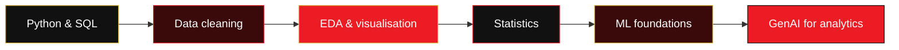

<div align="center">

<!-- HERO PLACEHOLDER: add your banner image below when ready (recommended width: 1000px). -->
<!--  -->


# SACHIN DUMBRE

### DATA SCIENCE · ANALYTICS · GENERATIVE AI


<br /><br />

*Studying the numbers behind a problem—then turning them into useful direction.*

<br />

<a href="https://github.com/sachincoder11"></a>

<br /><br />

<a href="mailto:sdineshdumbre@gmail.com"></a>
<a href="https://dev.to/sachincoder"></a>
<a href="https://github.com/sachincoder11"></a>

</div>

<br />

> `01` **RAW DATA** &nbsp;→&nbsp; `02` **ANALYSIS** &nbsp;→&nbsp; `03` **INSIGHT** &nbsp;→&nbsp; `04` **ACTION**

---

<div align="center">
  
</div>

## 01 — THE DATA BRIEF

<table>
  <tr>
    <td width="50%" valign="top">
      <strong>NOW</strong><br /><br />
      Learning data science through hands-on analysis: Python, SQL, exploratory data analysis, statistics, visualisation, and machine-learning foundations.
    </td>
    <td width="50%" valign="top">
      <strong>NORTH STAR</strong><br /><br />
      FinTech + Data + AI — building analytical systems that make financial information clearer, more useful, and easier to act on.
    </td>
  </tr>
</table>

I’m focused on the work between a messy dataset and a confident decision: cleaning the data, finding the signal, explaining the result, and communicating what should happen next.

---

<div align="center">
  
</div>

## 02 — CURRENT INNINGS

| Discipline | What I’m working on | Why it matters |
| :--- | :--- | :--- |
| **Data analysis** | Python · Pandas · NumPy · SQL · EDA | Understand the shape, quality, and story in a dataset. |
| **Statistics & visualisation** | Descriptive statistics · Matplotlib · Seaborn | Test assumptions and make patterns easy to see. |
| **Machine learning** | scikit-learn foundations | Learn how models can support data-driven decisions. |
| **Generative AI** | LLM applications · RAG · embeddings · vector databases | Explore useful AI-assisted analysis workflows. |
| **Applied focus** | Revenue · cost · trends · anomalies · profitability | Bring analytical thinking to FinTech problems. |

---

<div align="center">
  
</div>

## 03 — DATA TOOLBOX

<div align="center">
  <a href="https://skillicons.dev">
    
  </a>
</div>

<br />

<table>
  <tr>
    <td width="33%" valign="top">
      <strong>CORE</strong><br /><br />
      Python<br />SQL<br />Pandas<br />NumPy
    </td>
    <td width="33%" valign="top">
      <strong>ANALYSE &amp; EXPLAIN</strong><br /><br />
      EDA<br />Statistics<br />Matplotlib · Seaborn<br />scikit-learn
    </td>
    <td width="33%" valign="top">
      <strong>AI EXPLORATION</strong><br /><br />
      RAG · LLM applications<br />Embeddings<br />Hugging Face · Ollama<br />ChromaDB · Sentence Transformers
    </td>
  </tr>
</table>

---

<div align="center">
  
</div>

## 04 — FEATURED ANALYSIS

### FinTech Data Analytics & AI Platform

**Mission:** turn raw financial data into a reliable analytical narrative.

```text
INPUT              ANALYSIS                         OUTPUT
──────────────────────────────────────────────────────────────────
Financial data  →  Cleaning & quality checks    →  Trustworthy base
                 →  EDA & statistical analysis  →  Trends and context
                 →  Visual pattern detection     →  Clear evidence
                 →  AI-assisted interpretation   →  Useful business insight
```

| Analysis area | Questions the platform is designed to help investigate |
| :--- | :--- |
| **Revenue & costs** | What is changing, where, and why might it matter? |
| **Risk signals** | Are there outliers, anomalies, losses, or quality issues to investigate? |
| **Opportunity** | Where could profitability or efficiency improve? |
| **Interpretation** | How can data findings be translated into understandable next steps? |

<div align="center">
  
  
  
  
</div>

---

<div align="center">
  
</div>

## 05 — LEARNING SCORECARD



This is a learning path, not a list of claims. I’m building depth one dataset and one project at a time.

---

<div align="center">
  
</div>

## 06 — PREVIOUS BUILDS

Before moving my focus to data science, I built web products. That experience informs how I think about usable, real-world data tools.

| Project | Stack | Scope |
| :--- | :--- | :--- |
| 🩸 **Blood Bank Management System** | React · Tailwind CSS | Web interface for blood-bank workflows. |
| 🏠 **Real Estate Applications** | React · Node.js · Express · MySQL | Full-stack applications for real-estate use cases. |
| 🏡 **Weekender / Villa Booking Platform** | React · Vite · Tailwind CSS · Node.js · MySQL | Booking-oriented full-stack product. |
| ✈️ **TravelNexus** | HTML · CSS · JavaScript · PHP | Travel-focused web application. |

---

<div align="center">
  
</div>

## 07 — GITHUB ACTIVITY

<div align="center">
  <a href="https://git.io/streak-stats"></a>
  <br /><br />
  
</div>

---

<div align="center">

### LET’S TURN DATA INTO DIRECTION.

Open to collaboration on **data, analytics, AI, and FinTech** projects.

<a href="mailto:sdineshdumbre@gmail.com"></a>

<br /><br />

`RED` &nbsp; `GOLD` &nbsp; `BLACK` &nbsp; · &nbsp; inspired by a fan’s #PlayBold spirit.

<br /><br />


</div>
